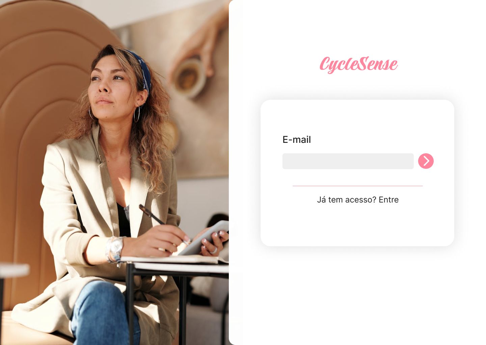
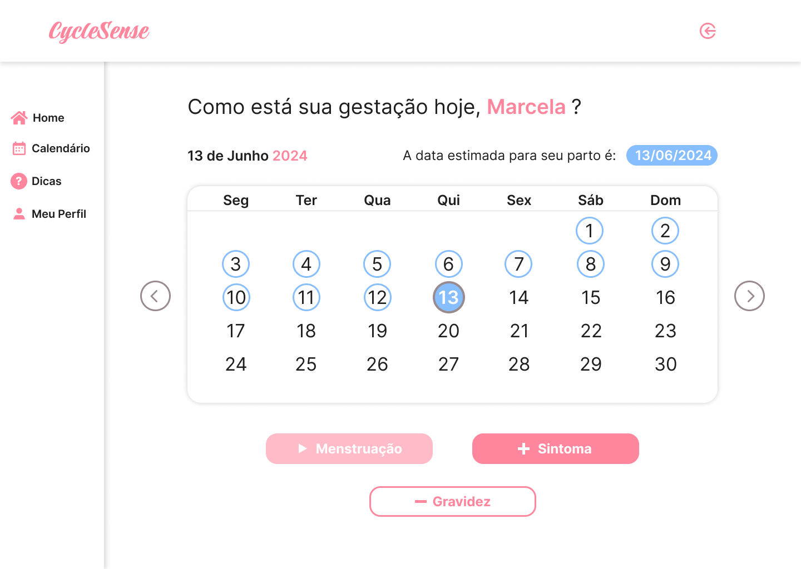
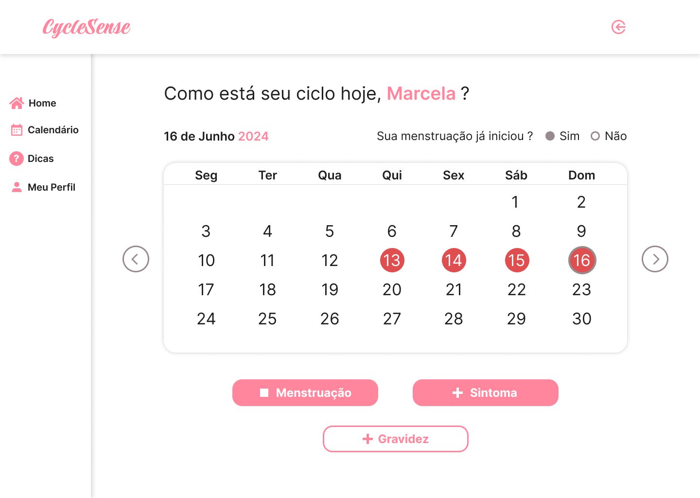
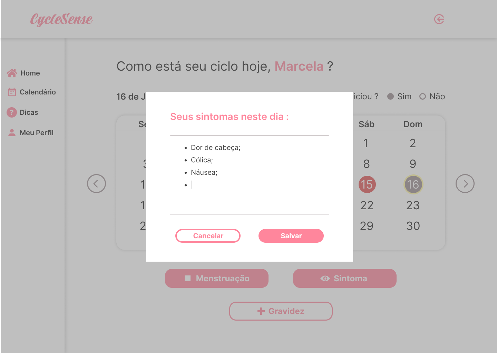
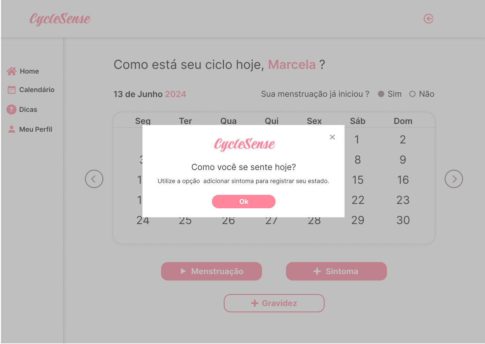
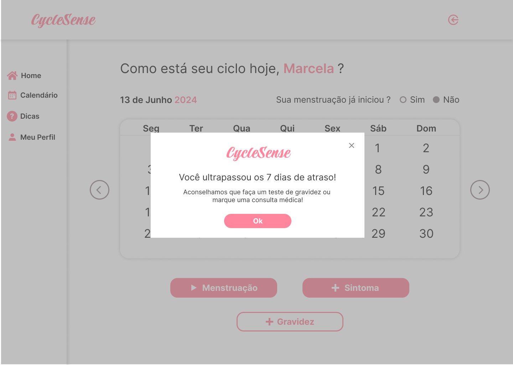
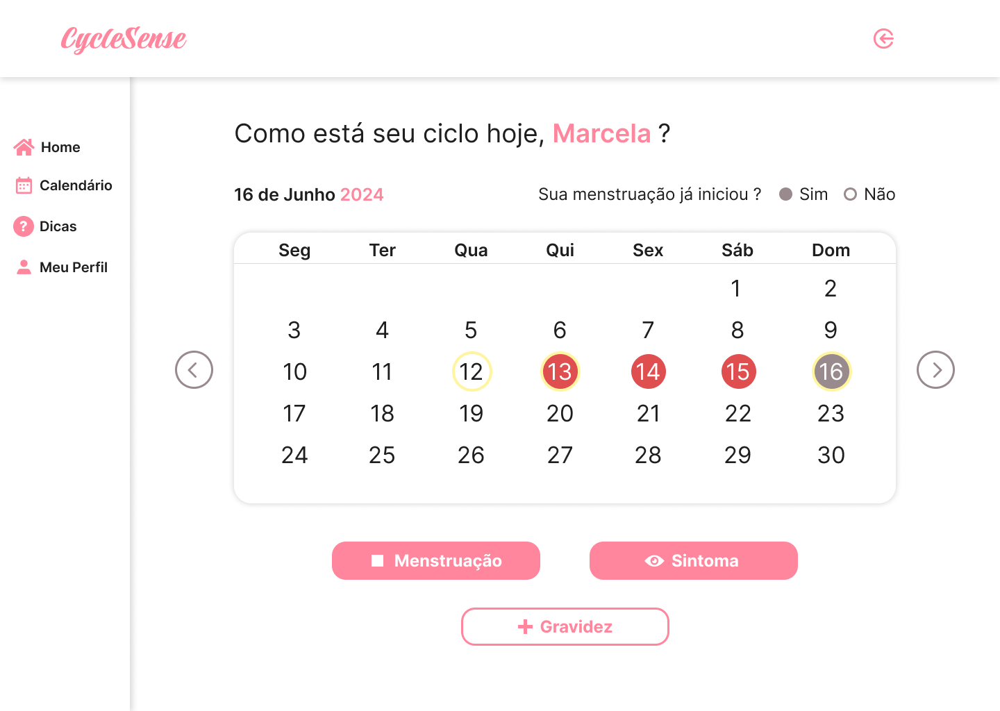
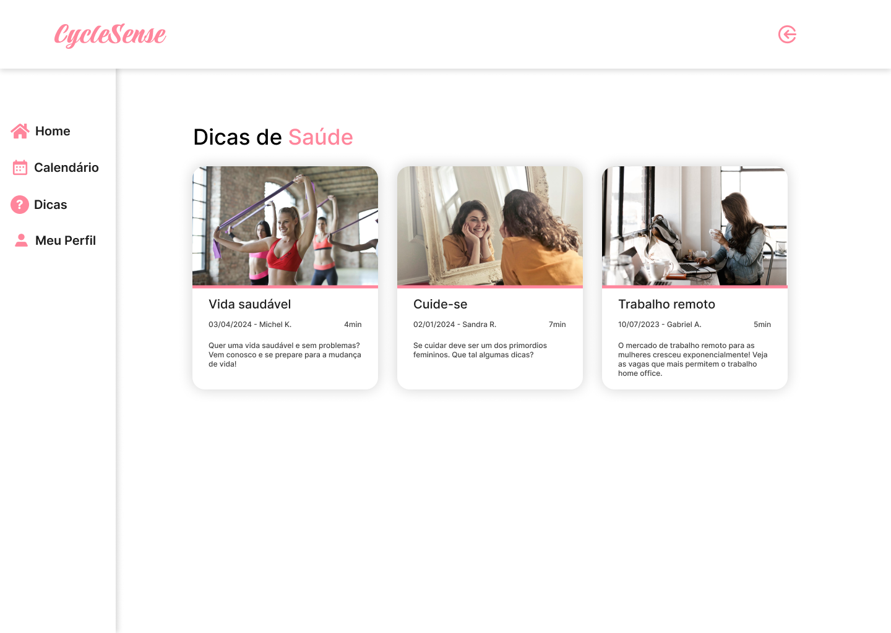

<h1 align="center">PROJETO INTEGRADOR: DESENVOLVIMENTO DE SISTEMA WEB MODULARIZÁVEL</h1>

Repertório criado para o PROJETO INTEGRADOR: DESENVOLVIMENTO DE SISTEMA WEB MODULARIZÁVEL do curso de Tecnologia em Sistemas para Internet do Senac São Paulo, 17/06/2024.

# Projeto Integrador - 1ª Entrega: Proposta de Aplicação Web no Contexto da Saúde Humana

## Integrantes 
<ul>
    <li>DAYANE SCHEFFEMACHER TERENCIO</li>
    <li>GABRIEL ALVES DE SOUZA</li>
    <li>GABRIELE BUSS ROCKENBACH</li>
    <li>JEAN CARLOS LOPES DA SILVA</li>
    <li>LETICIA CARVALHO DE LIMA</li>
    <li>MATHEUS JOSE MALAGI</li>
    <li>MICHEL DE QUADROS KRUGER</li>
    <li>SANDRA REGINA LOPES BALBINO</li>
</ul>

## Resumo

Criada com o objetivo de fornecer informações e apoio quanto à saúde da menstrual da mulher ou indivíduo transgênero que se identifique como homem, nossa  aplicação WEB, que nomeamos como CycleSense, visa abordar temas como menstruação e descoberta da gravidez, especificamente. Na página principal apresentaremos uma descrição do projeto, exibindo conteúdos educativos e informações gerais. Teremos como links principais: Tela inicial, Login (e-mail – senha), Cadastro, Dicas, Informações, Calendário Seção Menstrual / Gravidez, Meu perfil, além de direcionamento para contato de profissionais da saúde que a mulher julgue necessário e útil. 
    

O front-end da aplicação foi desenvolvido utilizando React, que proporciona uma interface dinâmica e responsiva aos usuários. Implementamos o Node.js como back-end para gerenciar o banco de dados e lidar com a lógica do servidor. O banco de dados utilizado é SQL para armazenar todas as informações dos usuários e conteúdos de forma estruturada.

A integração entre essas tecnologias vai nos permitir realizar operações de cadastro e exclusão de usuários e conteúdos. O back-end será feito em Node.js, que deverá verificar se um usuário já está registrado antes de permitir um novo cadastro, exibindo uma mensagem de erro caso já esteja cadastrado no sistema.

Além disso, o Node.js vai gerenciar as requisições do front-end feito em React, garantindo que a comunicação seja eficiente e segura entre o cliente e o servidor. Essa aplicação oferece uma experiência fluida e integrada para que os usuários tenham informações seguras sobre saúde menstrual.

## Introdução

A  demanda crescente por soluções tecnológicas na área da saúde humana cria uma oportunidade valiosa para o desenvolvimento de uma aplicação web. O CycleSense pode significativamente aprimorar a qualidade de vida das pessoas, tornando mais fácil e eficiente o acesso a informações sobre saúde menstrual. Nossa proposta visa abordar essas necessidades de forma inovadora, integrando-as ao contexto atual com sensibilidade e acolhimento.

## Visão de Produto

 O projeto visa informar e agregar conhecimento sobre a saúde feminina no que diz respeito a menstruação e possível descoberta da gravidez.

### Público-Alvo

O público-alvo do CycleSense são mulheres cisgênero e indivíduos transgêneros em período fértil que buscam informações e suporte sobre a saúde menstrual.

### Dificuldade Apresentada

Muitas pessoas encontram grandes dificuldades não só em obter informações confiáveis, de qualidade e personalizadas sobre a sua saúde, como também de forma rápida e ágil, sem constrangimento ou exclusão. Existem lacunas significativas no acompanhamento contínuo de condições específicas, como saúde menstrual, prevenção e gravidez.

### Missão do Aplicativo Web

A missão do CycleSense é empoderar essas mulheres e indivíduos transgêneros com informações precisas, personalizadas e acessíveis sobre a sua saúde menstrual, promovendo bem-estar através de um acompanhamento contínuo, sensível e integrado.

### Benefícios Gerados
- **Informações Personalizadas**: Conteúdos e dicas específicas para a fase menstrual e descoberta da gravidez.
- **Acompanhamento Contínuo**: Monitoramento de saúde menstrual e descoberta da gravidez.
- **Acesso Fácil ao Calendário**: Conexão direta ao controle menstrual através do calendário.
- **Comunidade de Suporte**: Fórum de discussão e grupos de apoio entre usuárias (os).

### Diferencial Entre Propostas Concorrentes

Nosso diferencial é a personalização do conteúdo com base nos dados inseridos pelos usuários, a integração das várias fases da saúde feminina em uma única plataforma e a oferta de suporte comunitário, criando um ambiente de suporte contínuo e abrangente.

## Descrição de Personas

### Persona 1: Júlia Amorim.
- **Idade**: 17 anos
- **Profissão**: Estudante de Ensino Médio
- **Comportamento**: Usuária assídua de tecnologia, busca informações sobre saúde menstrual.
- **Necessidades**: Acompanhar seu ciclo menstrual e receber dicas de saúde.
- **Objetivos**: Manter-se informada e saudável durante sua rotina agitada de estudos.

### Persona 2: Alex da Silva.
- **Idade**: 27 anos
- **Profissão**: Designer Gráfico
- **Comportamento**: Trabalhador dedicado com pouco tempo para cuidar da saúde menstrual.
- **Necessidades**: Informação sobre cuidados e contracepção .
- **Objetivos**: Acompanhar a saúde de maneira prática e rápida.

### Persona 3: Ana Guedes de Souza. 
- **Idade**: 38 anos
- **Profissão**: Professora
- **Comportamento**: Está tentando engravidar pela quinta vez com grande dificuldade, sem filhos.
- **Necessidades**: informações e apoio online para entender melhor sua situação e explorar possíveis soluções.
- **Objetivos**: Gerir o calendário menstrual para obter informações sobre seu período fértil.

## Proposta de Protótipo

Utilizando ferramentas como Figma, desenvolvemos um protótipo funcional que contempla as principais funcionalidades do CycleSense:

- **Tela Inicial**: Login (E-mail e Senha), Entrar, Não tem acesso? Cadastre-se.
- **Seção Menstrual**: Calendário menstrual.
- **Seção Gravidez**: Grávida ou não.
- **Comunidade**: Fóruns e grupos de suporte.

## Objetivos e Observações

### Objetivos
- **Integrar Conhecimento Acadêmico**: Aplicar teorias de saúde menstrual em um contexto prático.
- **Desenvolver uma Solução Prática**: Criar uma aplicação funcional que atenda às necessidades reais dos usuários.
- **Promover Saúde Preventiva**: Incentivar práticas de saúde preventiva através de informações acessíveis.

### Observações
- **Usabilidade**: O design da interface deve ser intuitivo e fácil de usar, garantindo que todas as funcionalidades sejam acessíveis mesmo para aqueles usuários com pouca experiência em tecnologia.
- **Segurança dos Dados**: Garantir a privacidade e a segurança das informações pessoais dos usuários.

## Jornada do Usuário

### Definição

A jornada do usuário descreve as etapas que um usuário percorre ao interagir com a aplicação, desde o primeiro contato até a utilização contínua.

### Exemplo de Jornada: Júlia
1. **Descoberta**: Júlia encontra a aplicação através de uma recomendação no Instagram.
2. **Inscrição**: Baixa a aplicação e cria seu perfil, fornecendo dados sobre seu ciclo menstrual.
3. **Utilização Inicial**: Júlia navega pelo dashboard e começa a usar o calendário menstrual.
4. **Interação Contínua**: Júlia recebe notificações diárias com dicas de saúde e acompanha seu ciclo.
5. **Engajamento**: Participa de fóruns de discussão e marca consultas virtuais com ginecologistas.

## Oportunidades

A aplicação pode ser expandida para incluir funcionalidades adicionais, como integração com dispositivos de saúde (wearables), parcerias com clínicas de saúde feminina e a criação de conteúdo educativo em formato de vídeo.

## Telas do Protótipo

|   |   |
|      :-------------------------:          |        :-------------------------:       |
|         **Tela de Login**               |     **Tela de cadastro E-mail**   |

&nbsp;

|   |   |
|      :-------------------------:          |        :-------------------------:       |
|   **Tela de cadastro Nome**    |      **Tela de cadastro Sobrenome**      |

&nbsp;

|   |   |
|      :-------------------------:          |        :-------------------------:       |
|      **Tela de cadastro Data de Nascimnento**      |        **Tela de cadastro Senha**        |

&nbsp;

|   |   |
|      :-------------------------:          |        :-------------------------:       |
|         **Tela de Calendário (menstruação prevista)**               |     **Tela de Calendário (gravidez)**   |

&nbsp;

|   |   |
|      :-------------------------:          |        :-------------------------:       |
|   **Tela de Calendário (primeiro dia menstruação)**    |      **Tela de Calendário (menstruação em curso)**      |

&nbsp;

|   |   |
|      :-------------------------:          |        :-------------------------:       |
|      **Tela de Calendário (modal alerta de atraso)**      |        **Tela de Calendário (edição de sintomas)**        |

&nbsp;

|   |   |
|      :-------------------------:          |        :-------------------------:       |
|         **Tela de Calendário (excluir sintomas)**               |     **Tela de Calendário (modal sugestão de sintomas)**   |

&nbsp;

|   |   |
|      :-------------------------:          |        :-------------------------:       |
|   **Tela de Calendário (visualização sintomas)**    |      **Tela de Calendário (modal atraso superior 7 dias)**      |

&nbsp;

|   |   |
|      :-------------------------:          |        :-------------------------:       |
|      **Tela de Calendário (primeiro login)**      |        **Tela de Calendário (visualização de sintomas nos dias)**        |

&nbsp;

|   |   |
|      :-------------------------:          |        :-------------------------:       |
|         **Tela de Dicas (modo leitura)**               |     **Tela de Dicas (modo leitura)**   |

&nbsp;

|   |   |
|      :-------------------------:          |        :-------------------------:       |
|   **Tela de Dicas (modo leitura)**    |      **Tela de Dicas**      |

&nbsp;

|   |   |
|      :-------------------------:          |        :-------------------------:       |
|      **Tela Inicial**      |        **Tela Meu Perfil**        |

&nbsp;

## Conclusão

Nossa proposta de aplicação web para saúde menstrual visa atender a uma necessidade crescente no mercado. Oferecendo um serviço abrangente e personalizado que acompanhe as diferentes fases da vida menstrual até a descoberta da gravidez. Com foco na facilidade de uso, segurança de dados e apoio da comunidade, acreditamos que a aplicação pode ter um impacto positivo e duradouro na saúde menstrual das mulheres cisgênero e dos indivíduos transgêneros. A proposta apresentada busca não apenas resolver problemas específicos, mas também criar um ambiente acolhedor e informativo, onde todas as pessoas se sintam apoiadas e bem-informadas sobre sua saúde menstrual durante essas importantes fases da vida.

[Link do FIGMA](https://www.figma.com/proto/M2b9nOUJdAcxnxyYBuiccA/PI---CycleSense?node-id=42-32&t=cJlAjggOrituLi0c-0&scaling=scale-down-width&content-scaling=fixed&page-id=41%3A23&starting-point-node-id=42%3A32)

<li><strong>Para baixar este projeto no <a href="https://github.com/SRLB50/Projeto-Integrador-Desenvolvimento-de-Sistema-WEB-Modularizavel">Github</a></strong>, https://github.com/SRLB50/Projeto-Integrador-Desenvolvimento-de-Sistema-WEB-Modularizavel</li>

